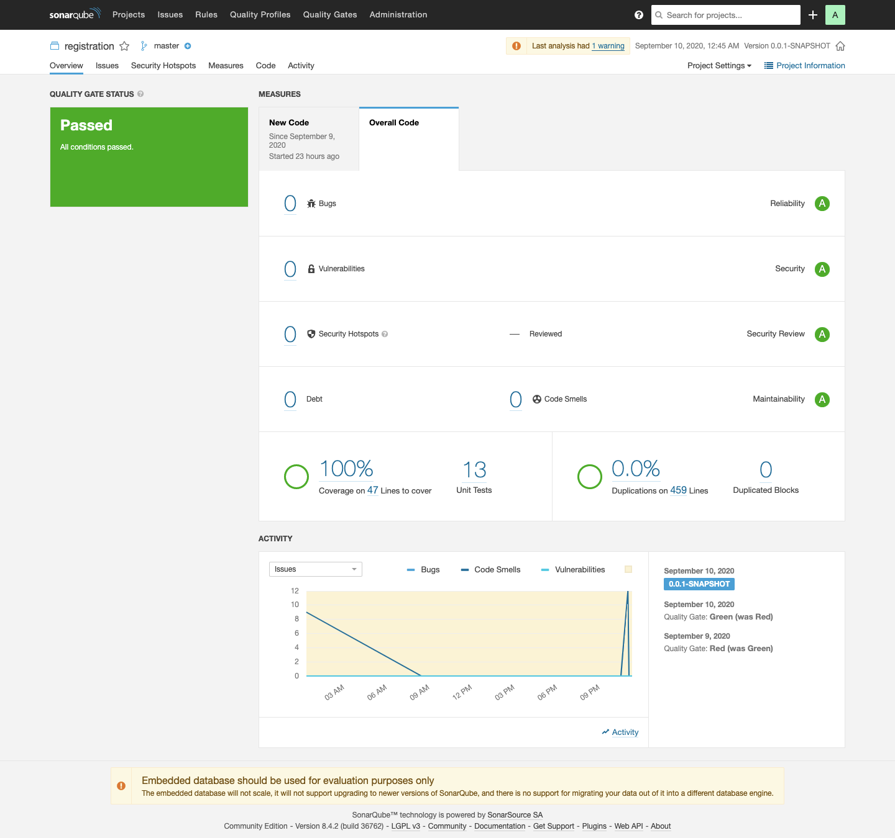

## Backend Technology Used
1. Spring Boot 2.3
2. Posgtres
3. JPA
4. Mapstruct
5. Maven
6. JUnit, Mockito

## Frontend Technology Used
1. ReactJS
2. Axios

## How to run
1. Running backend application
    - Create database with name 'registration' on your postgres database
    - Go to folder 'backend', with command ```cd backend```
    - Open application.yml to config database and other on folder 'backend/src/main/resources', example :
      ```
      spring:        
        datasource:
          url: jdbc:postgresql://${POSTGRES_HOSTNAME:localhost}:${POSTGRES_PORT:5432}/${POSTGRES_DATABASE:registration}
          username: ${POSTGRES_USERNAME:postgres}
          password: ${POSTGRES_PASSWORD:password}
      allow:
        origins: ${ORIGIN:http://localhost:3000,http://localhost:80}
      ```
      1. Using environment variable, example :
         - add environment variable ```POSTGRES_HOSTNAME=localhost``` (database host)
         - add environment variable ```POSTGRES_PORT=5432``` (database port)
         - add environment variable ```POSTGRES_DATABASE=registration``` (database name)
         - add environment variable ```POSTGRES_USERNAME=postgres``` (database user)
         - add environment variable ```POSTGRES_PASSWORD=password``` (password of user)
         - add environment variable ```ORIGIN=http://localhost:3000,http://localhost:80``` (allow origins)     
    - Running backend application, by default this backend application running on port 8080. Running with command 
        ```mvn spring-boot:run```

2. Running frontend application
    - Go to folder 'frontend', with command ```cd frontend```
    - Open axios.js to config backend host on folder 'src/config'
      ```
      const instance = axios.create({
          baseURL:"http://localhost:8080",
      })
      ```
    - Install dependencies with command ```npm install```
    - Running frontend application, by default this application running on port 3000. Running with command ```npm start```

### Code Quality using jacoco and SonarQube


Result :
1. Bugs : 0
2. Vulnerabilities : 0
3. Security Hotspot : 0
3. Debt : 0
4. Code Smells : 0
5. Code Coverage : 100% with 13 Unit Test (459 Lines of code)
6. Duplications : 0%
7. Duplicate Block : 0

